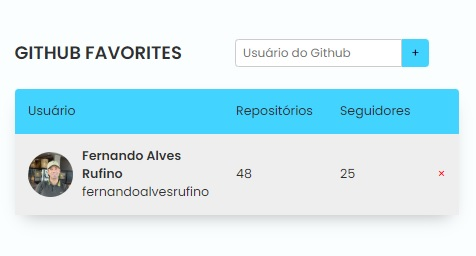

<h1 align="center"> GitHub Favorites </h1>

  <a href="#technologies">Technologies</a>&nbsp;&nbsp;&nbsp;|&nbsp;&nbsp;&nbsp;
  <a href="#project">Project</a>&nbsp;&nbsp;&nbsp;|&nbsp;&nbsp;&nbsp;
  <a href="#files">Files</a>&nbsp;&nbsp;&nbsp;|&nbsp;&nbsp;&nbsp;
  <a href="#how-to-use">How to Use</a>&nbsp;&nbsp;&nbsp;|&nbsp;&nbsp;&nbsp;
  <a href="#license">License</a>&nbsp;&nbsp;&nbsp;|&nbsp;&nbsp;&nbsp;
  <a href="#readme-in-portuguese">README in Portuguese</a>

  

 
  
  

## Technologies

- HTML
- CSS
- JavaScript
- Git and GitHub
- Figma

## Project

This is a project that allows you to add favorite Github users and display some information about them, such as repositories and followers. The project interface is an HTML page that interacts with the Github API to retrieve user data.

## Files

- `index.html`: HTML file that defines the page structure and contains the markup and layout.

- `style.css`: CSS file that provides the visual style for the page.

- `main.js`: JavaScript file responsible for initializing the application.

- `Favorites.js`: JavaScript file that contains the Favorites and FavoritesView classes responsible for managing favorites and displaying the table of favorite users.

- `GithubUser.js`: JavaScript file that contains the GithubUser class responsible for performing user searches on Github using its API.

## How to Use

To access the finished project, [click here](https://fernandoalvesrufino.github.io/github-favorites/).

## License

This project is licensed under the MIT License.

by Fernando Rufino

`Project created by Rocketseat`

 

## README in Portuguese

<h1 align="center"> Favoritos GitHub </h1>

  <a href="#tecnologias">Tecnologias</a>&nbsp;&nbsp;&nbsp;|&nbsp;&nbsp;&nbsp;
  <a href="#projeto">Projeto</a>&nbsp;&nbsp;&nbsp;|&nbsp;&nbsp;&nbsp;
  <a href="#arquivos">Arquivos</a>&nbsp;&nbsp;&nbsp;|&nbsp;&nbsp;&nbsp;
  <a href="#como-usar">Como Usar</a>&nbsp;&nbsp;&nbsp;|&nbsp;&nbsp;&nbsp;
  <a href="#licença">Licença</a>

  

 
  
  

## Tecnologias

- HTML
- CSS
- JavaScript
- Git e GitHub
- Figma

## Projeto

Este é um projeto que permite adicionar usuários favoritos do Github e exibir algumas informações sobre eles, como repositórios e seguidores. A interface do projeto é uma página HTML que interage com a API do Github para obter os dados dos usuários.
## Arquivos

- `index.html`: Arquivo HTML que define a estrutura da página e contém a marcação e o layout.

- `style.css`: Arquivo CSS que fornece o estilo visual para a página.

- `main.js`: Arquivo JavaScript que é responsável por iniciar a aplicação.

- `Favorites.js`: Arquivo JavaScript que contém as classes Favorites e FavoritesView responsáveis por gerenciar os favoritos e exibir a tabela de usuários favoritos.

- `GithubUser.js`: Arquivo JavaScript que contém a classe GithubUser responsável por realizar a pesquisa de usuários no Github usando sua API.

## Como Usar

- Para acessar ao projeto finalizado, [clique aqui](https://fernandoalvesrufino.github.io/github-favorites/).

## Licença

Esse projeto está sob a licença MIT.

by Fernando Rufino

`Projeto criado pela Rocketseat`